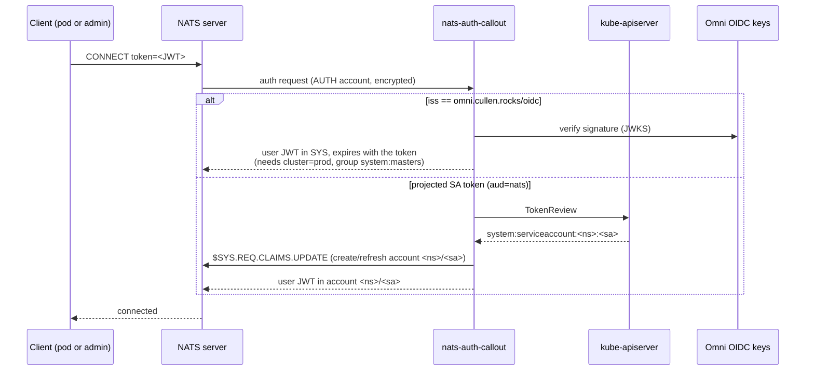

# nats-auth-callout

NATS auth callout for the homelab cluster. Pods authenticate with a projected
ServiceAccount token; admins authenticate with their Omni OIDC token. Nothing is
stored: every key is derived from one secret.



- Each `namespace/serviceaccount` gets its own NATS account, created on first connect and
  pushed to the server's full resolver. The `default` ServiceAccount is rejected.
- Per-account caps: 50 connections, 1000 subscriptions, 1 MiB payload, no leafnodes,
  JetStream 1 GiB disk / 10 streams / 100 consumers. NATS has no msgs/sec throttle; these are caps.

## Bootstrap

```bash
# 1. the one secret (1Password -> ExternalSecret -> NATS_AUTH_MASTER)
op item create --vault k8s-secrets --category login --title nats-auth-callout
op item edit nats-auth-callout --vault k8s-secrets --generate-password='letters,digits,64'

# 2. print the server config (operator, SYS/AUTH accounts, sentinel)
NATS_AUTH_MASTER="$(op item get nats-auth-callout --vault k8s-secrets --fields password --reveal)" \
  go run . init
```

3. Merge the printed JSON into the homelab repo's `k8s/nats/values.yaml` under `config.merge`.

The service reads `NATS_AUTH_MASTER` (required) and `NATS_URL` (default `nats://nats.nats:4222`).

## Develop and build

`flox activate` provides Go, ko and the nats CLI. Then `go test -race ./...`.

Depot CI (`.depot/workflows/ci.yml`) tests every push and PR. Pushes to main and `v*` tags also
build `ghcr.io/cullenmcdermott/nats-auth-callout` (amd64 + arm64) with ko and sign it with cosign.
Pin the digest in the Deployment. The image runs as nonroot (uid 65532, distroless static base)
and needs no writable filesystem. Verify a signature with
`cosign verify --key cosign.pub ghcr.io/cullenmcdermott/nats-auth-callout@sha256:<digest>`.

Depot CI secrets (in Depot, not GitHub): `GHCR_TOKEN` (org-wide) and repo-scoped `COSIGN_PRIVATE_KEY` and
`COSIGN_PASSWORD`, also kept in the 1Password item `nats-auth-callout cosign` (vault Private).

To build locally without pushing:

```bash
KO_DOCKER_REPO=ghcr.io/cullenmcdermott/nats-auth-callout ko build --bare --push=false .
```

## Workload usage

Give the workload its own ServiceAccount, then project a token with audience `nats`:

```yaml
spec:
  serviceAccountName: my-app   # not "default"
  containers:
    - name: app
      volumeMounts:
        - { name: nats-token, mountPath: /var/run/secrets/nats, readOnly: true }
  volumes:
    - name: nats-token
      projected:
        sources:
          - serviceAccountToken:
              audience: nats
              path: token
              expirationSeconds: 3600
```

The connection is dropped when the token expires. Re-read the file on every (re)connect so the
client reconnects transparently with the rotated token:

```go
nc, err := nats.Connect("nats://nats.nats:4222",
    nats.MaxReconnects(-1),
    nats.TokenHandler(func() string {
        b, _ := os.ReadFile("/var/run/secrets/nats/token")
        return strings.TrimSpace(string(b))
    }))
```

## Admin usage

```bash
TOKEN=$(kubectl oidc-login get-token \
  --oidc-issuer-url=https://omni.cullen.rocks/oidc \
  --oidc-client-id=native --oidc-extra-scope=cluster:prod | jq -r .status.token)
nats --server wss://nats.cullen.rocks --token "$TOKEN" server list
```

Requires `cluster=prod` and `system:masters` in the token. You land in the SYS account and the
session expires with the token.

## Known ceilings

- One master secret is the whole trust root. Rotating it re-keys every account and orphans their
  JetStream data.
- A deleted pod stays connected until its token expires (at most `expirationSeconds`).
- The Omni token is a live cluster-admin credential. It crosses the in-cluster websocket leg in
  plaintext after Traefik terminates TLS.
- Cross-account sharing (exports/imports) is not implemented.
- No rate limit on JWKS refetches for unknown `kid`s; bounded only by the 8 workers and the 1.5s
  per-request budget.
- Accounts are never garbage-collected, and any ServiceAccount in any namespace gets one (no
  namespace allowlist; fine for a single-owner cluster).
- The JetStream per-account disk limit is soft in clustered mode.
- If the resolver data is wiped, the callout re-pushes accounts only after it restarts.
