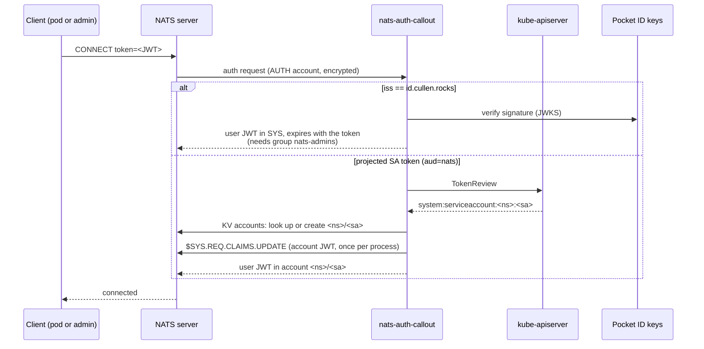

# nats-auth-callout

NATS auth callout for the homelab cluster. Pods authenticate with a projected
ServiceAccount token; admins authenticate with a Pocket ID token. Keys are derived from two
secrets, and the only state is a KV bucket mapping each ServiceAccount to its account.



- Each `namespace/serviceaccount` gets its own NATS account, created on first connect and
  pushed to the server's full resolver. The `default` ServiceAccount is rejected.
- An account's identity key is random and discarded at once. Its public key is kept in the
  `accounts` KV bucket in the AUTH account, on the same JetStream storage as the data it owns.
  If NATS data is lost, both go together and workloads get fresh, empty accounts.

## Keys

| Secret | Derives | Where it lives |
|---|---|---|
| `NATS_OPERATOR_SECRET` | identities of the operator, SYS and AUTH | 1Password `nats-auth-callout operator` (vault Private), used only by `init`; never in the cluster |
| `NATS_AUTH_MASTER` | every signing key, the xkey, the callout's own users | 1Password `nats-auth-callout` (vault k8s-secrets) → ExternalSecret |

Users are signed with account signing keys and accounts with the operator signing key, so rotating
`NATS_AUTH_MASTER` re-signs everything but changes no identity: JetStream data is kept.
- Per-account caps: 50 connections, 1000 subscriptions, 1 MiB payload, no leafnodes,
  JetStream 1 GiB disk / 10 streams / 100 consumers. NATS has no msgs/sec throttle; these are caps.
  Raise the disk cap per account with `NATS_ACCOUNT_DISK=namespace/serviceaccount=bytes,...`;
  it counts every replica, so an R3 stream of N bytes needs 3N.

## Bootstrap

```bash
# 1. the two secrets
op item create --vault Private --category password --title 'nats-auth-callout operator' \
  --generate-password='letters,digits,64'
op item create --vault k8s-secrets --category login --title nats-auth-callout \
  --generate-password='letters,digits,64'

# 2. print the server config and the callout's env
NATS_OPERATOR_SECRET="$(op read 'op://Private/nats-auth-callout operator/password')" \
NATS_AUTH_MASTER="$(op read op://k8s-secrets/nats-auth-callout/password)" \
  go run . init
```

3. In the homelab repo, merge `.config` into `k8s/nats/values.yaml` under `config.merge`, and set
   `.env` (`NATS_SYS_ACCOUNT`, `NATS_AUTH_ACCOUNT`, both public keys) on the callout Deployment.
4. In Pocket ID, create a public OIDC client with client ID `nats` and device code enabled, and a
   `nats-admins` group with your user in it.

The service reads `NATS_AUTH_MASTER`, `NATS_SYS_ACCOUNT`, `NATS_AUTH_ACCOUNT` (all required) and
`NATS_URL` (default `nats://nats.nats:4222`).

### Rotating `NATS_AUTH_MASTER`

Generate a new password in the `nats-auth-callout` item, rerun `init`, and roll out the new
`.config` (bump the pod annotation in `values.yaml`, since the operator can't be hot-reloaded)
together with the callout. Logins fail until both are on the new keys. Existing connections drop
and reconnect. Each account is re-signed the first time it is used after the restart.

## Develop and build

`flox activate` provides Go, ko and the nats CLI. Then `go test -race ./...`.

Depot CI (`.depot/workflows/ci.yml`) tests every push and PR. Pushes to main and `v*` tags also
build `ghcr.io/cullenmcdermott/nats-auth-callout` (amd64 + arm64) with ko and sign it with cosign.
Pin the digest in the Deployment. The image runs as nonroot (uid 65532, distroless static base)
and needs no writable filesystem. Verify a signature with
`cosign verify --key cosign.pub ghcr.io/cullenmcdermott/nats-auth-callout@sha256:<digest>`.

Depot CI secrets (in Depot, not GitHub): `GHCR_TOKEN` (org-wide) and repo-scoped `COSIGN_PRIVATE_KEY` and
`COSIGN_PASSWORD`, also kept in the 1Password item `nats-auth-callout cosign` (vault Private).

To build locally without pushing:

```bash
KO_DOCKER_REPO=ghcr.io/cullenmcdermott/nats-auth-callout ko build --bare --push=false .
```

## Workload usage

Give the workload its own ServiceAccount, then project a token with audience `nats`:

```yaml
spec:
  serviceAccountName: my-app   # not "default"
  containers:
    - name: app
      volumeMounts:
        - { name: nats-token, mountPath: /var/run/secrets/nats, readOnly: true }
  volumes:
    - name: nats-token
      projected:
        sources:
          - serviceAccountToken:
              audience: nats
              path: token
              expirationSeconds: 3600
```

The connection is dropped when the token expires. Re-read the file on every (re)connect so the
client reconnects transparently with the rotated token:

```go
nc, err := nats.Connect("nats://nats.nats:4222",
    nats.MaxReconnects(-1),
    nats.TokenHandler(func() string {
        b, _ := os.ReadFile("/var/run/secrets/nats/token")
        return strings.TrimSpace(string(b))
    }))
```

## Admin usage

```bash
TOKEN=$(kubectl oidc-login get-token --grant-type=device-code \
  --oidc-issuer-url=https://id.cullen.rocks --oidc-client-id=nats \
  --oidc-extra-scope=groups | jq -r .status.token)
nats --server wss://nats.cullen.rocks --token "$TOKEN" server list
```

Requires the `nats-admins` group. You land in the SYS account and the session expires with the
token. The token is only valid for NATS (`aud=nats`), not for anything else Pocket ID protects.

## Observability

Logs are JSON on stderr, one `auth` line per decision:

```json
{"level":"WARN","msg":"auth","kind":"workload","who":"system:serviceaccount:app:default","result":"deny","ms":4,"ip":"10.244.1.7","client":"","server":"nats-1","err":"denied: give the workload its own ServiceAccount"}
```

`result` is `allow`, `deny` (bad credential: client's problem) or `error` (TokenReview, KV or
account push failed: ours). Account creation and pushes are logged too. Port 8080 serves:

| Path | |
|---|---|
| `/healthz` | 503 while either NATS connection is down (liveness probe) |
| `/metrics` | `nats_auth_callout_decisions_total{kind,result}`, `nats_auth_callout_duration_seconds{kind}`, `nats_auth_callout_accounts_created_total`, `nats_auth_callout_errors_total` (requests never answered), `nats_auth_callout_up`, plus Go runtime |

## Known ceilings

- `NATS_AUTH_MASTER` can sign for any account until it is rotated. Rotation is a short outage,
  not a seamless handover (the operator lists only one signing key at a time).
- Losing `NATS_OPERATOR_SECRET` means rebuilding the trust root, which orphans all JetStream data.
- A deleted pod stays connected until its token expires (at most `expirationSeconds`).
- The admin token crosses the in-cluster websocket leg in plaintext after Traefik terminates TLS.
- Cross-account sharing (exports/imports) is not implemented.
- No rate limit on JWKS refetches for unknown `kid`s; bounded only by the 8 workers and the 1.5s
  per-request budget.
- Accounts are never garbage-collected, and any ServiceAccount in any namespace gets one (no
  namespace allowlist; fine for a single-owner cluster).
- The JetStream per-account disk limit is soft in clustered mode.
- If the resolver data is wiped but JetStream's isn't, the callout re-pushes accounts only after it
  restarts.
